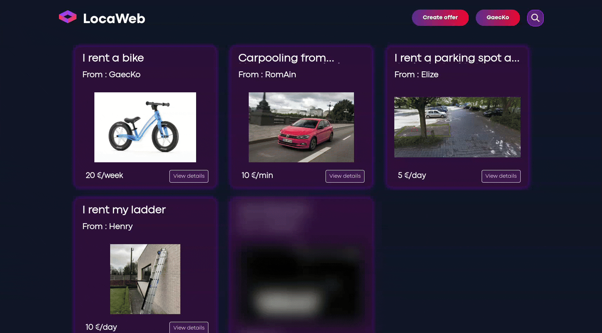
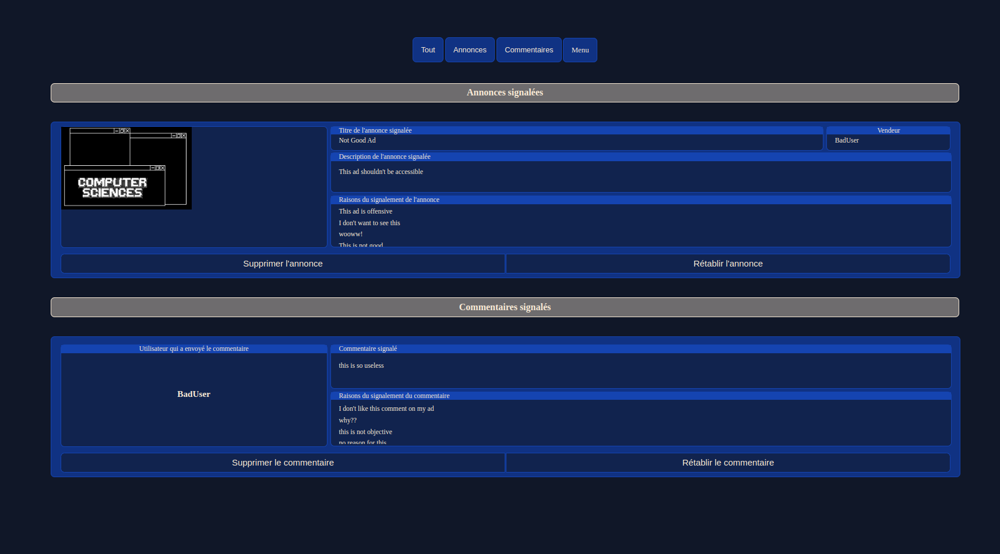
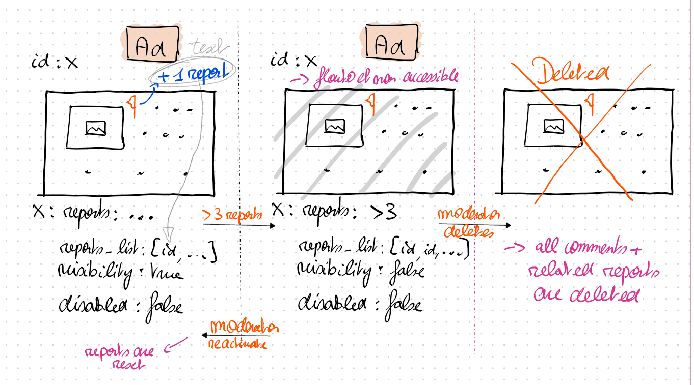
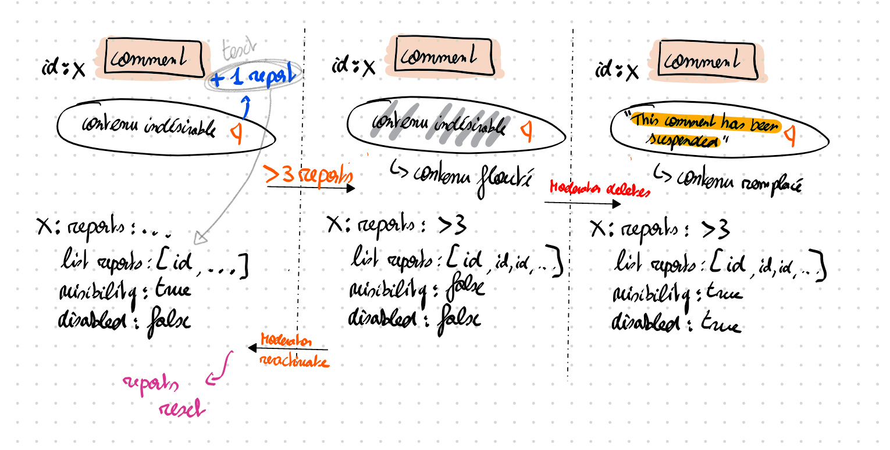

****

## Description Générale :

**LocaWeb** est un site sur lequel il est facile de poster des `annonces de location`. Le site permet de se `créer un compte`, d'`ajouter des choses à louer` (places de parking, vélos, voitures, ...) et d'avoir un `contrôle complet sur cette annonce` (modification, suppression, ...). Du côté consommateur, il est possible d'`ajouter des commentaires` sur ces annonces, de les `enregistrer` et de les `signaler`. Il y a aussi des `comptes modérateurs` ayant accès à une interface spécifique afin de `gérer ces signalements`. 

****

> [!TIP] 
> Un guide d'installation et d'utilisation se trouve [ici](./site/README.md).

> [!NOTE]  
> Le fichier `database.js` est entièrement documenté ; le fichier HTML reprenant cette documentation se trouve [ici](./site/out/global.html). Il faudra cependant télécharger / cloner le projet pour avoir le rendu complet.  

## Page d'accueil  

## Annonces  

 
* Un utilisateur peut parcourir les annonces postées sur le site.  
* Sur une annonce, un utilisateur peut :  
    * Voir les informations du vendeur (celles que celui-ci a autorisé à partager).  
    * Parcourir les photos et voir la description de l'annonce.  
    * Voir les commentaires, y répondre, en écrire (avec un système de tag dans les réponses).  
    * Signaler l'annonce.  
    * Signaler un commentaire.  

## Profil  

* La page de profil permet de :  
    * Mettre à jour ses informations et son mot de passe.  
    * Changer ses préférences visuelles.  
    * Voir son nombre de signalements reçus.  

## Modération  

* Les signalements suivent une logique mise en place et facilement adaptable.  
    * Schéma à main levée de la logique des signalements d'une annonce :  
    
    
    * Schéma à main levée de la logique des signalements d'un commentaire :  
    

* Les comptes modérateurs peuvent, depuis la page de modération, supprimer ou rétablir une annonce / un commentaire.  
* De manière générale, après x signalements (ici x = 3), le commentaire ou l'annonce devient flouté(e) / inaccessible automatiquement. Il doit dès lors être analysé par la modération.  
